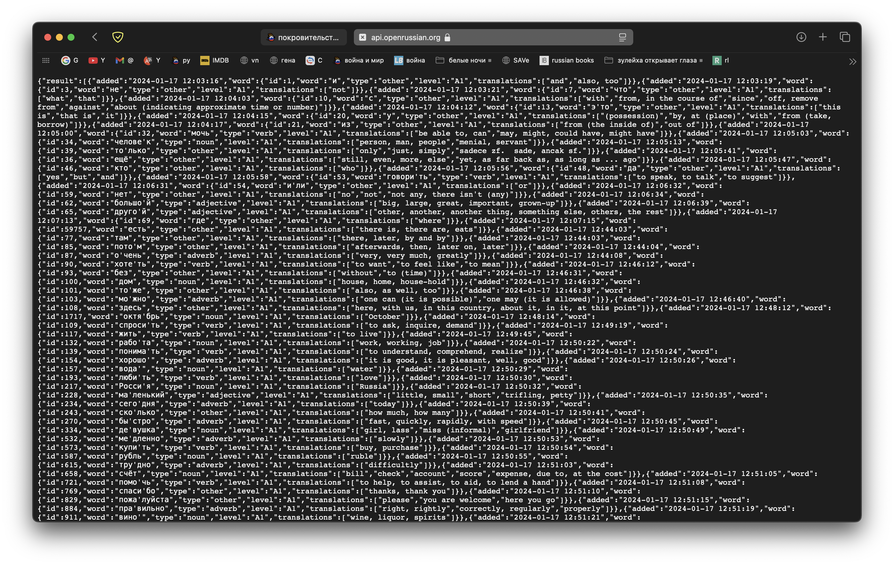
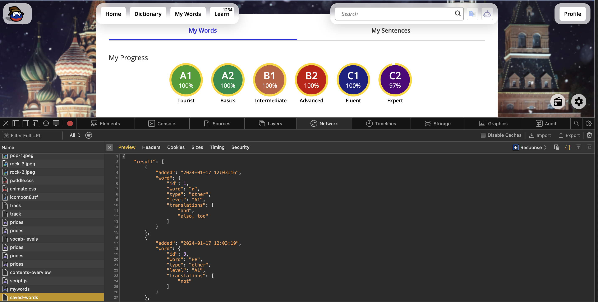

# OpenRussian Vocabulary Analysis 📊

A simple, client-side web tool to visualize your learning progress on [OpenRussian](https://en.openrussian.org/).

**[🚀 Launch Web Analyzer](https://towbyxo3.github.io/openrussian-vocabulary-analysis/)**  
([View Example Report](https://towbyxo3.github.io/openrussian-vocabulary-analysis/assets/example.html))

### How to get your data
Since OpenRussian doesn't have an export button (yet), we just grab the data the website uses.

#### Option 1: Direct Link (Easier)
1.  Log in to your [OpenRussian](https://en.openrussian.org/) Account.
2.  Go to **[https://api.openrussian.org/api/my/saved-words?lang=en](https://api.openrussian.org/api/my/saved-words?lang=en)**.

    

3.  Right-click and **Save As...** (save as `.json`).
    *Alternatively: Copy all text and save it as a `.json` file.*
4.  Drop the file into the [website](https://towbyxo3.github.io/openrussian-vocabulary-analysis/).

#### Option 2: via Developer Tools (Backup)
1.  Log in and go to **[My Words](https://en.openrussian.org/mywords)**.
2.  Open Developer Tools (`F12`).
3.  Go to the **Network** tab and refresh the page.
4.  Right-click the **`saved-words`** request -> **Copy Response**.
5.  Save content as `my_vocab.json`.

---
*Credit to [OpenRussian](https://en.openrussian.org/) for providing the excellent learning platform and database.*
