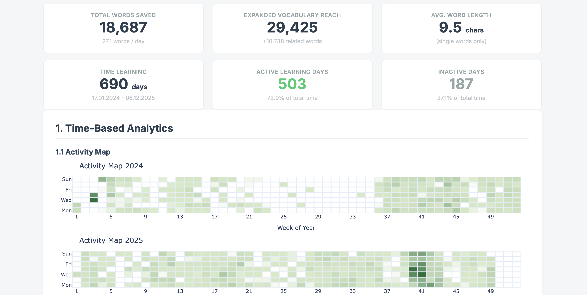

# OpenRussian Vocabulary Analysis 📊

A simple, client-side web tool to visualize your learning progress on [OpenRussian](https://en.openrussian.org/).

**[🚀 Launch Web Analyzer](https://towbyxo3.github.io/openrussian-vocabulary-analysis/)**  
([View Example Report](https://towbyxo3.github.io/openrussian-vocabulary-analysis/assets/example.html))

### How to get your data
Since OpenRussian doesn't have an export button (yet), we just grab the data the website uses.

1.  Log in to your [OpenRussian](https://en.openrussian.org/) Account and go to the **[My Words](https://en.openrussian.org/mywords)** tab.
2.  Open Developer Tools (Press `F12` or right-click -> "Inspect").
3.  Go to the **Network** tab.
4.  Refresh the page.
5.  Look for a request named **`saved-words`** (it might take a second).
6.  Right-click it -> **Copy Response** (or copy the content from the Response tab).
7.  Paste it into a text file and save it as `.json` (e.g., `my_vocab.json`).

8.  Drop that file into the [website](https://towbyxo3.github.io/openrussian-vocabulary-analysis/).

---
*Credit to [OpenRussian](https://en.openrussian.org/) for providing the excellent learning platform and database.*
